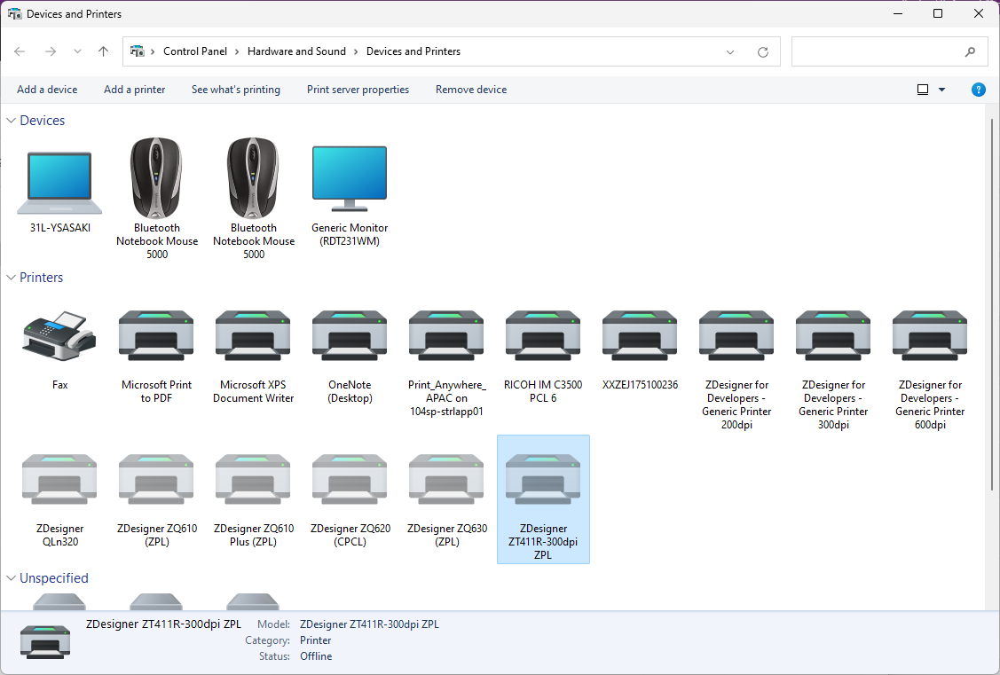
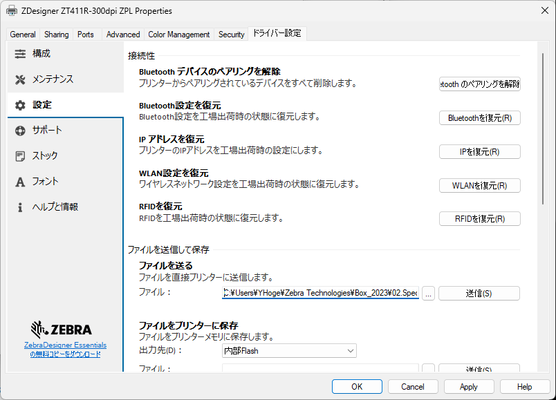

## Windows ドライバを用いてZebra Printerにデータを送信する方法

1. [デバイスとプリンタ]を開く。

 
1. 送信先プリンタを右クリック > [Printer Propaties]を選択。
 
1. [ドライバ設定]タブ > [設定] >を選択。
 
1. [ファイルを送る]にて対象データを選択し、[送信]を選択。

 
1. 送信したファイルがプリンタに保存されるマテリアルである場合は下記コマンドにてプリンタ内にファイルが存在するかを確認する。

    # コマンド
    ! U1 do "file.dir" "E"

    # 返り値の例
    file.dir : 
    - DIR *:*.* 
    * E:ANGSANA.TTF     95452          
    * E:CONFIG.SYS        27          
    * E:GT16NF55.CPF    310457          
    * E:TT0003M_.TTF    169188          

End

